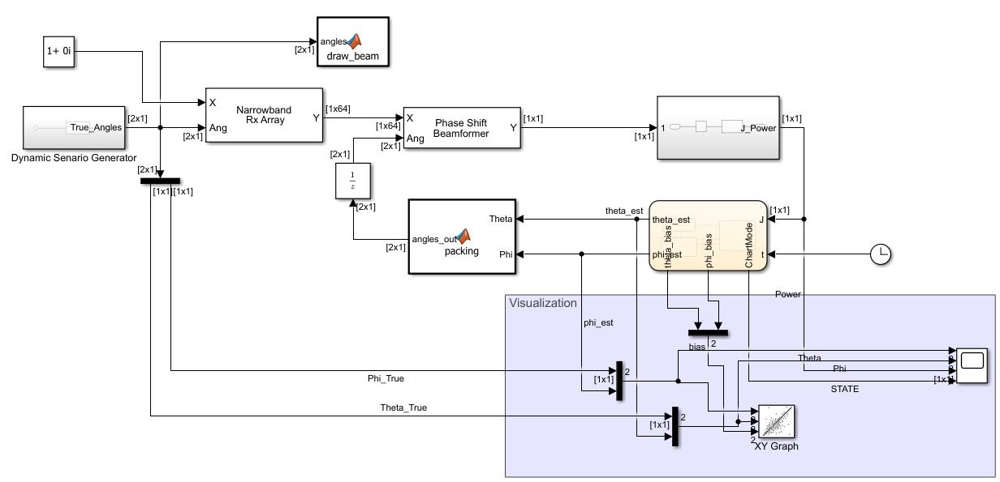
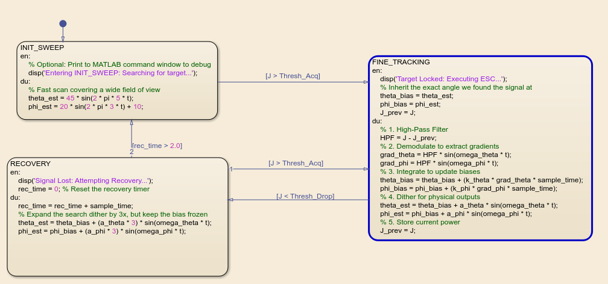
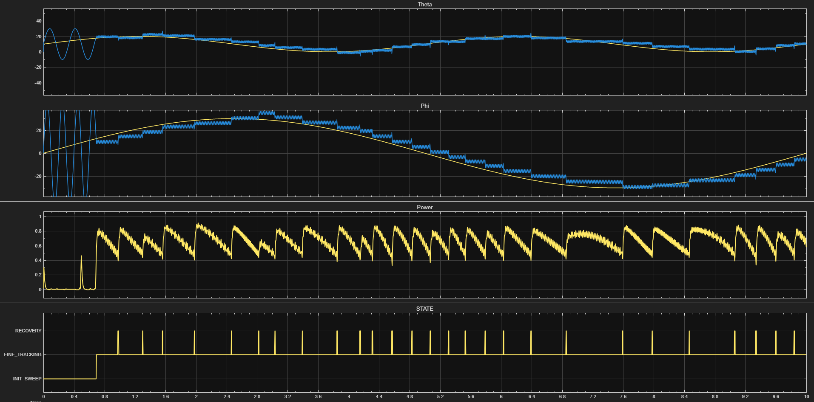

# 5G Adaptive Beamforming 

*Live 3D polar radiation pattern showing the main lobe dynamically sweeping the environment.*

An autonomous 5G base station simulation built in MATLAB and Simulink. This project implements a multi-state Extremum Seeking Control (ESC) algorithm to dynamically track a mobile target moving in a Lissajous trajectory using an 8x8 Uniform Planar Array (UPA) operating at 28 GHz.

## Overview

The core objective of this system is to maintain an optimal 5G millimeter-wave signal link without relying on GPS or explicit target position data. Instead, the system uses "blind" signal power gradient descent—wobbling the beam slightly (dithering) to sense the direction of highest power, and continuously updating the azimuth and elevation steering angles to follow the target in real-time.

## Architecture

The system is split into two primary domains: the physical electromagnetic simulation (the "Plant") and the algorithmic state machine (the "Brain").
* **The Physical Layer (Simulink & Phased Array Toolbox):** Models the 28 GHz millimeter-wave propagation, the 64-element UPA, and the phase shift beamforming.
* **The Control Layer (Stateflow):** A 3-state autonomous machine (`INIT_SWEEP`, `FINE_TRACKING`, `RECOVERY`) that processes instantaneous power drops and calculates the required steering gradients.

*Top-level Simulink architecture showing the scenario generator, physical array, and ESC controller.*

*The 3-state Stateflow machine handling acquisition, tracking, and signal loss recovery.*

## Results

The simulation successfully demonstrates real-time beam steering, maintaining a high-power lock on a rapidly moving target. The ESC successfully rejects noise and adapts to sudden trajectory changes.

*Phase-space radar visualization (Azimuth vs. Elevation) showing the ESC algorithm hunting and locking onto the true target path.*

*Master telemetry scope detailing the active control state, angular tracking errors, and received signal power.*

## Challenges and Solutions

Building a hybrid physics-control simulation presented several highly specific engineering hurdles:

* **5G mmWave Filtering Trap:** * *Challenge:* The raw antenna array output a flatline of zeros because default Simulink isotropic elements filter out frequencies above 300 MHz.
  * *Solution:* Manually bypassed the element-level frequency range limits in the Narrowband Rx Array to accept the 28 GHz carrier wave.
* **Controller Chattering & Limit Cycles:** * *Challenge:* The ESC entered a panic state, continuously jumping between tracking and recovery, creating square artifacts on the radar plot.
  * *Solution:* Widened the hysteresis band (50/10 Rule for thresholds), lowered the dither amplitude, and increased integrator gains to allow the system to ride through transient power dips without triggering a hard reset.
* **Visualization Jitter (Auto-Scaling):** * *Challenge:* The 3D wavefront figure violently zoomed and shook because MATLAB continuously auto-scaled the bounding box to fit the changing beam shape.
  * *Solution:* Wrote a custom `coder.extrinsic` script to hard-lock the axes limits, freeze the camera viewing angle, and explicitly delete rogue text objects to create a cinematic, frozen-grid animation.
* **Crossed Signal Routing:**
  * *Challenge:* Azimuth and Elevation signals were silently swapped due to Stateflow's alphabetical port assignment, causing the beam to track on the wrong axes.
  * *Solution:* Stripped the default routing and built a labeled multiplexing function block to force explicit, error-proof port connections.
 
## How to Run

1. Run the initialization script ([`init_beamforming_esc.m`](./scripts/init_beamforming_esc.m)) to load the physics parameters, antenna geometries, and tuning thresholds into the base workspace.
2. Run the Simulink model ([`Adaptive_Beamforming_ESC.slx`](./models/Adaptive_Beamforming_ESC.slx))

## Future Improvements

* Multi-User Tracking (MU-MIMO): Expand the ESC algorithm to track multiple mobile targets simultaneously by deploying orthogonal dither frequencies for multiple independent beams.

* Adaptive Gain ESC: Implement an adaptive gain schedule that dynamically increases the integrator gain during high-speed maneuvers and lowers it during slow movements to minimize steady-state oscillation.

* 3D Random Walk Trajectories: Replace the deterministic Lissajous trajectory with a stochastic 3D random walk (incorporating variable velocities and sudden direction changes) to test the limits of the recovery state.

* Hardware-in-the-Loop (HIL): Interface the Simulink model with Software Defined Radios (SDRs), such as the USRP, to transmit and receive actual RF signals based on the algorithm's outputs.

## References

1. **Extremum Seeking Control (ESC) & State Machine Logic:** * Ariyur, K. B., & Krstić, M. (2003). *Real-Time Optimization by Extremum-Seeking Control*. John Wiley & Sons.
   * Tan, Y., Moase, W. H., Manzie, C., Nesic, D., & Mareels, I. M. (2010). "Extremum seeking from 1922 to 2010." *Proceedings of the 29th Chinese Control Conference*, 14-26.
   * MathWorks. (n.d.). [*Modeling Bang-Bang Controllers and State Machines using Stateflow*](https://www.mathworks.com/products/stateflow.html). MathWorks Documentation.
2. **5G Millimeter-Wave & Phased Array Physics:**
   * Balanis, C. A. (2015). *Antenna Theory: Analysis and Design* (4th ed.). John Wiley & Sons. 
   * Rappaport, T. S., et al. (2013). "Millimeter Wave Mobile Communications for 5G Cellular: It Will Work!". *IEEE Access*, 1, 335-349. [DOI: 10.1109/ACCESS.2013.2260813](https://ieeexplore.ieee.org/document/6515173).
   * Van Trees, H. L. (2002). *Optimum Array Processing: Part IV of Detection, Estimation, and Modulation Theory*. John Wiley & Sons.
3. **Mathematics & Trajectory Generation:**
   * Kreyszig, E. (2011). *Advanced Engineering Mathematics* (10th ed.). John Wiley & Sons.
   * Weisstein, Eric W. ["Lissajous Curve."](https://mathworld.wolfram.com/LissajousCurve.html) *MathWorld—A Wolfram Web Resource*. 
4. **Software Tools & Visualization Methods:**
   * [MATLAB Phased Array System Toolbox Documentation](https://www.mathworks.com/products/phased-array.html)
   * MathWorks. (n.d.). [*Using coder.extrinsic to Call MATLAB Functions in Simulink*](https://www.mathworks.com/help/simulink/ug/calling-matlab-functions-from-simulink-using-coder-extrinsic.html). MathWorks Documentation.
