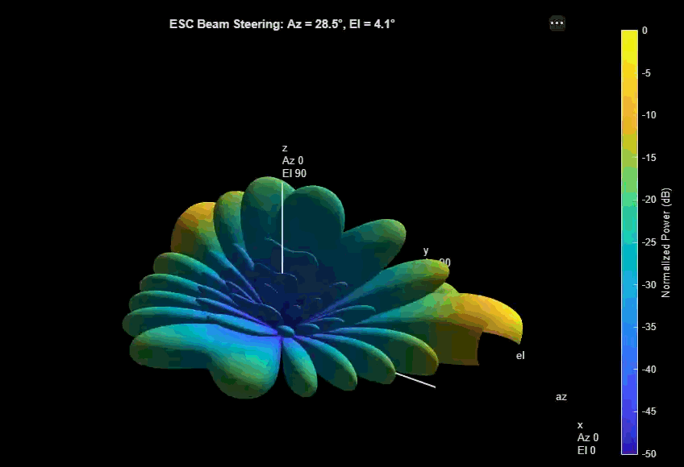
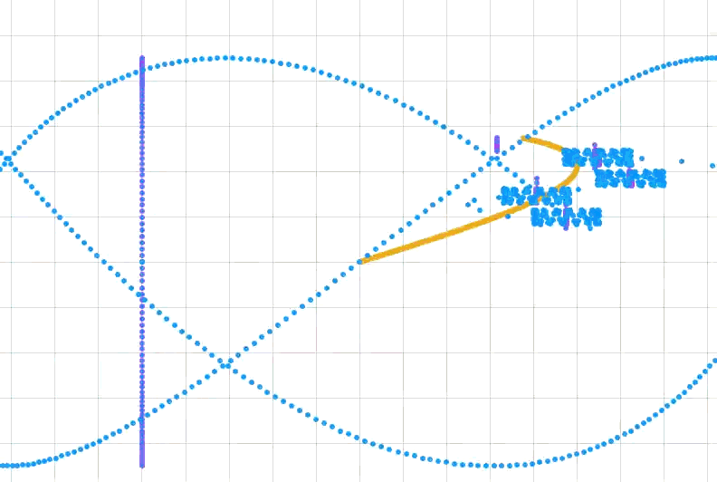

# 5G Adaptive Beamforming 

*Live 3D polar radiation pattern showing the main lobe dynamically sweeping the environment.*

An autonomous 5G base station simulation built in MATLAB and Simulink. This project implements a multi-state Extremum Seeking Control (ESC) algorithm to dynamically track a mobile target moving in a Lissajous trajectory using an 8x8 Uniform Planar Array (UPA) operating at 28 GHz.

## Overview

The core objective of this system is to maintain an optimal 5G millimeter-wave signal link without relying on GPS or explicit target position data. Instead, the system uses "blind" signal power gradient descent—wobbling the beam slightly (dithering) to sense the direction of highest power, and continuously updating the azimuth and elevation steering angles to follow the target in real-time.

## Architecture

The system is split into two primary domains: the physical electromagnetic simulation (the "Plant") and the algorithmic state machine (the "Brain").
* **The Physical Layer (Simulink & Phased Array Toolbox):** Models the 28 GHz millimeter-wave propagation, the 64-element UPA, and the phase shift beamforming.
* **The Control Layer (Stateflow):** A 3-state autonomous machine (`INIT_SWEEP`, `FINE_TRACKING`, `RECOVERY`) that processes instantaneous power drops and calculates the required steering gradients.

*Top-level Simulink architecture showing the scenario generator, physical array, and ESC controller.*

*The 3-state Stateflow machine handling acquisition, tracking, and signal loss recovery.*

## Results

The simulation successfully demonstrates real-time beam steering, maintaining a high-power lock on a rapidly moving target. The ESC successfully rejects noise and adapts to sudden trajectory changes.

*Phase-space radar visualization (Azimuth vs. Elevation) showing the ESC algorithm hunting and locking onto the true target path.*

*Master telemetry scope detailing the active control state, angular tracking errors, and received signal power.*

## Challenges and Solutions

Building a hybrid physics-and-control simulation presented several highly specific engineering hurdles spanning electromagnetic modeling, software architecture, and control theory.

| Engineering Challenge | Architectural Solution & Rationale |
| :--- | :--- |
| **5G mmWave Filtering Trap** The default Simulink isotropic antenna elements act as low-pass filters, completely attenuating the 28 GHz carrier wave and resulting in a zero-power signal flatline. | **Bypassed Element Constraints:** Manually overrode the default element-level frequency range limits within the Narrowband Rx Array block, forcing the array physics to accept and process millimeter-wave frequencies natively. |
| **ESC Limit Cycles & Chattering** The tracking algorithm became trapped in a rapid feedback loop between `FINE_TRACKING` and `RECOVERY` states, creating physical "square" artifacts on the tracking radar. | **Hysteresis & Gain Tuning:** Implemented the "50/10 Rule" for drop/acquire thresholds to widen the hysteresis band. Attenuated the physical dither amplitude and increased the integrator gains, allowing the system to ride through transient signal nulls without triggering a hard reset. |
| **Dither Cross-Talk & Axis Drift** If the horizontal and vertical perturbation frequencies ($\omega_\theta$ and $\omega_\phi$) share common harmonics, the gradient demodulation cross-contaminates, causing the beam to drift diagonally off-target. | **Orthogonal Frequency Selection:** Selected strictly non-harmonic, prime-based frequencies (e.g., 50 Hz and 73 Hz) for the dither signals to ensure mathematically clean, completely independent gradient extraction on both axes. |
| **3D Render Auto-Scaling Jitter** MATLAB's graphics engine dynamically recalculates the bounding box and camera lens angle (`CameraViewAngle`) on every frame to fit the morphing beam, causing a violent, shaky animation. | **Custom Extrinsic Pipeline:** Built a `coder.extrinsic` visualization script that hard-locks the physical axes limits, explicitly freezes the camera viewing angle, and actively sweeps/deletes rogue text objects on every frame to ensure a cinematic, frozen-grid animation. |
| **Implicit Port Swapping** Azimuth and Elevation tracking signals were silently crossed. Stateflow implicitly assigns output port numbers alphabetically by default, causing the radar to track the target on inverted axes. | **Explicit Multiplexing:** Stripped the default implicit routing and designed a custom `MATLAB Function` block with explicitly named input pins (`Azimuth_Theta` and `Elevation_Phi`), forcing strict, error-proof physical connections on the Simulink canvas. |
| **Multi-Domain Solver Bottlenecks** Simulating 28 GHz electromagnetic phase shifts alongside a macroscopic mechanical beam-steering algorithm requires vastly different time domains, grinding the simulation to a halt. | **Baseband Equivalent & Discrete Timing:** Utilized baseband equivalent modeling for the RF signals (abstracting away the high-frequency carrier) and implemented a fixed-step discrete solver to maintain computational efficiency while accurately capturing the ESC dynamics. |
 
## How to Run

1. Run the initialization script ([`init_beamforming_esc.m`](./scripts/init_beamforming_esc.m)) to load the physics parameters, antenna geometries, and tuning thresholds into the base workspace.
2. Run the Simulink model ([`Adaptive_Beamforming_ESC.slx`](./models/Adaptive_Beamforming_ESC.slx))

## Future Improvements

* Multi-User Tracking (MU-MIMO): Expand the ESC algorithm to track multiple mobile targets simultaneously by deploying orthogonal dither frequencies for multiple independent beams.

* Adaptive Gain ESC: Implement an adaptive gain schedule that dynamically increases the integrator gain during high-speed maneuvers and lowers it during slow movements to minimize steady-state oscillation.

* 3D Random Walk Trajectories: Replace the deterministic Lissajous trajectory with a stochastic 3D random walk (incorporating variable velocities and sudden direction changes) to test the limits of the recovery state.

* Hardware-in-the-Loop (HIL): Interface the Simulink model with Software Defined Radios (SDRs), such as the USRP, to transmit and receive actual RF signals based on the algorithm's outputs.

## References

1. **Extremum Seeking Control (ESC) & State Machine Logic:** * Ariyur, K. B., & Krstić, M. (2003). *Real-Time Optimization by Extremum-Seeking Control*. John Wiley & Sons.
   * Tan, Y., Moase, W. H., Manzie, C., Nesic, D., & Mareels, I. M. (2010). "Extremum seeking from 1922 to 2010." *Proceedings of the 29th Chinese Control Conference*, 14-26.
   * MathWorks. (n.d.). [*Modeling Bang-Bang Controllers and State Machines using Stateflow*](https://www.mathworks.com/products/stateflow.html). MathWorks Documentation.
2. **5G Millimeter-Wave & Phased Array Physics:**
   * Balanis, C. A. (2015). *Antenna Theory: Analysis and Design* (4th ed.). John Wiley & Sons. 
   * Rappaport, T. S., et al. (2013). "Millimeter Wave Mobile Communications for 5G Cellular: It Will Work!". *IEEE Access*, 1, 335-349. [DOI: 10.1109/ACCESS.2013.2260813](https://ieeexplore.ieee.org/document/6515173).
   * Van Trees, H. L. (2002). *Optimum Array Processing: Part IV of Detection, Estimation, and Modulation Theory*. John Wiley & Sons.
3. **Mathematics & Trajectory Generation:**
   * Kreyszig, E. (2011). *Advanced Engineering Mathematics* (10th ed.). John Wiley & Sons.
   * Weisstein, Eric W. ["Lissajous Curve."](https://mathworld.wolfram.com/LissajousCurve.html) *MathWorld—A Wolfram Web Resource*. 
4. **Software Tools & Visualization Methods:**
   * [MATLAB Phased Array System Toolbox Documentation](https://www.mathworks.com/products/phased-array.html)
   * MathWorks. (n.d.). [*Using coder.extrinsic to Call MATLAB Functions in Simulink*](https://www.mathworks.com/help/simulink/ug/calling-matlab-functions-from-simulink-using-coder-extrinsic.html). MathWorks Documentation.
