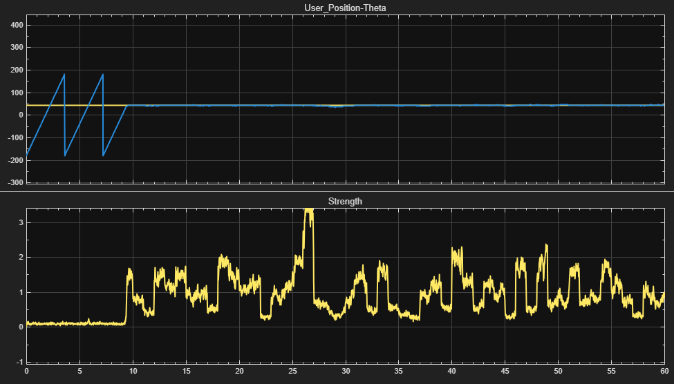
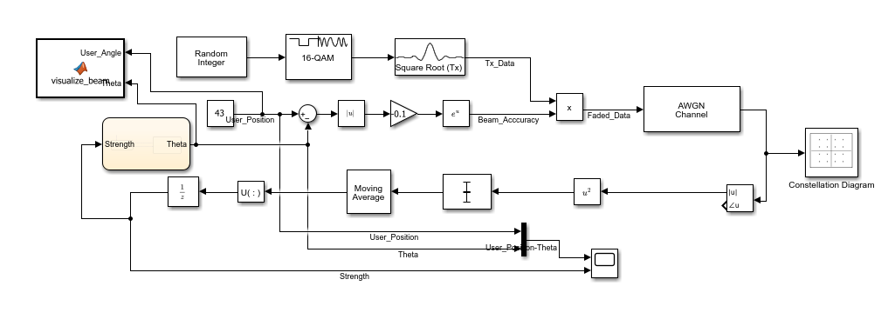
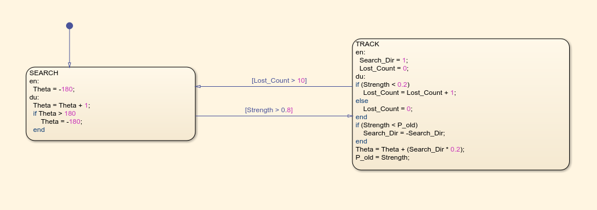
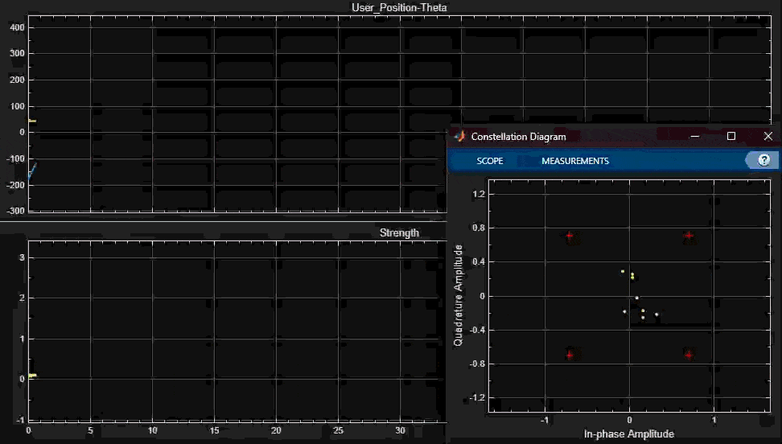

# 5G Adaptive Beamforming: Extremum Seeking Control

## Overview
This repository contains a closed-loop Simulink/Stateflow model simulating the initial acquisition and tracking phases of a 5G NR (New Radio) adaptive beamforming system. 

Unlike traditional Phase-Locked Loops (PLLs) that require an explicit phase error vector, this system operates entirely "blind" in the spatial domain. It utilizes **Extremum Seeking Control (ESC)** via a Gradient Ascent algorithm to locate a stationary user and optimize the Signal-to-Noise Ratio (SNR) across a highly noisy AWGN channel.

## System Architecture

The simulation merges physical layer telecommunications with non-linear control theory.

*Full closed-loop architecture: Spatial channel simulation, AWGN impairment, moving average DSP filters, and Stateflow baseband controller.*

1. **The Plant (Spatial Channel):** A Gaussian radiation pattern ($P = e^{-k(\phi - \Theta)^2}$) representing a massive MIMO antenna beam.
2. **The Data Link:** A 16-QAM modulated signal transmitted through an Additive White Gaussian Noise (AWGN) environment.
3. **The Controller (Stateflow):** A finite state machine evaluating the numerical derivative of the received power ($dP/dt$) to dynamically sweep the antenna array ($\Theta$) and lock onto the target.

*The ESC state machine transitioning from an open-loop spatial search to closed-loop peak-power dithering.*

## Key Results
* **Rapid Acquisition:** The ESC algorithm successfully locates the target within a full 360° spatial search using only blind power-feedback.
* **Robust Tracking:** The integration of DSP filters and Stateflow timing logic effectively suppresses high thermal noise (AWGN), preventing "Ping-Pong" connection drops.  
* **Data Integrity:** The beam steering maintains a sufficiently high and stable SNR to support flawless 16-QAM signal decoding.

## Installation & Usage

Source and Run the [simulink model](./models/adaptive_beamforming.slx)
